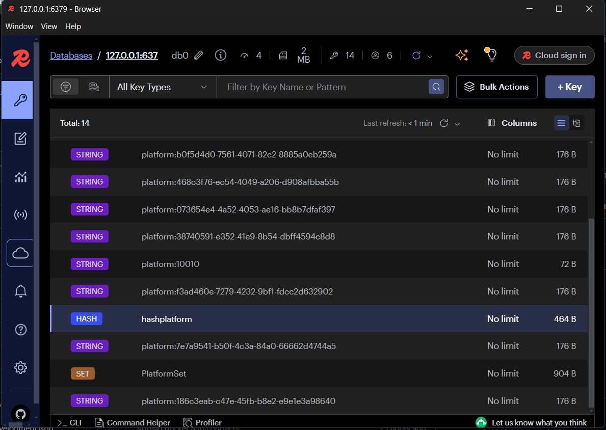
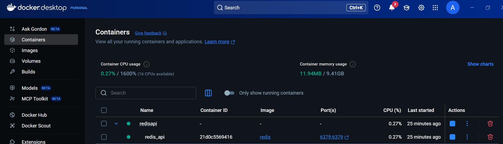

docker compose start
docker compose stop

docker ps
docker exec -it {id from ps} /bin/bash

redis-cli

ping

set platform:10010 Docker
get platform:10010
del platform:10010

https://redis.io/commands

install redis lib
Folder Models
	Platform.cs
Properties
Setting initial values
Decorate properties with Required
Folder Data
	IPlatformRepo
filling methods
	RedisPlatformRepo
implement interface
inject IConnectionMultiplexer (redis lib) in repository
creating methods logic
settings signature from method to expects null from the type
if don't find that's it
to create use serialize with JsonSerializer.Serialize(...)
and use .StringSet
to get use JsonSerializer.Deserialize<Platform>(...);
adding DI of new IPlatformRepo and RedisPlatformRepo as Scoped
adding PlatformsController
injecting ControllerBase
Decorate with [ApiController]
Decorate with [Route]
Creating endpoint in according to the contract (interface)
Decorating Get endpoint and naming it as GetPlatformById
Using this name in Create endpoint with CreateAtRoute(nameof,id,plat)
Sending request to Create and using the location from header to see it created

### To see all data persisted
docker ps
docker exec -it {id from ps} /bin/bash
redis-cli
scan 0

Creating a new route to get all info from Redis
Using new 'Set's 

Showing that is not the best approach to use 'Set's and instead of it you have 'Hash's

